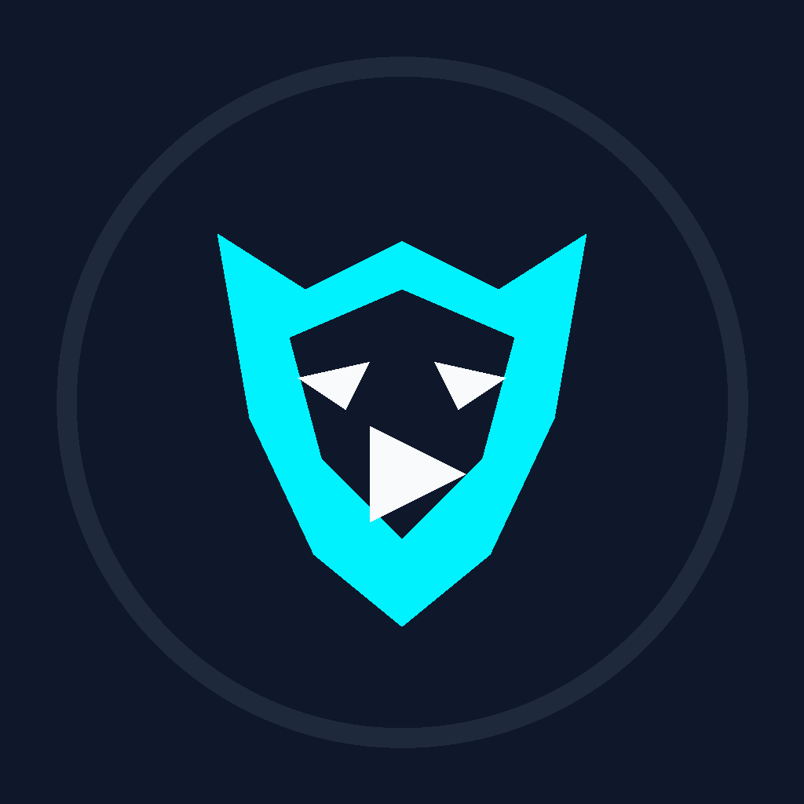
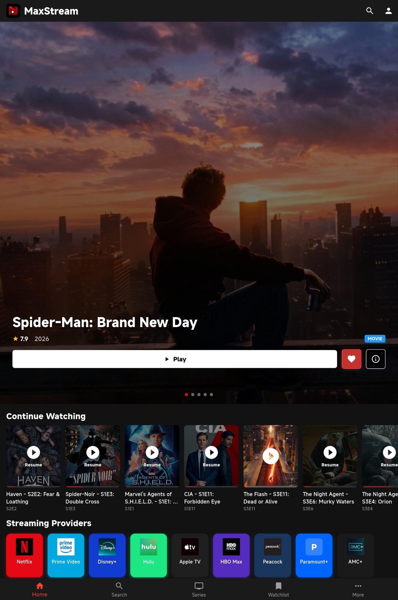
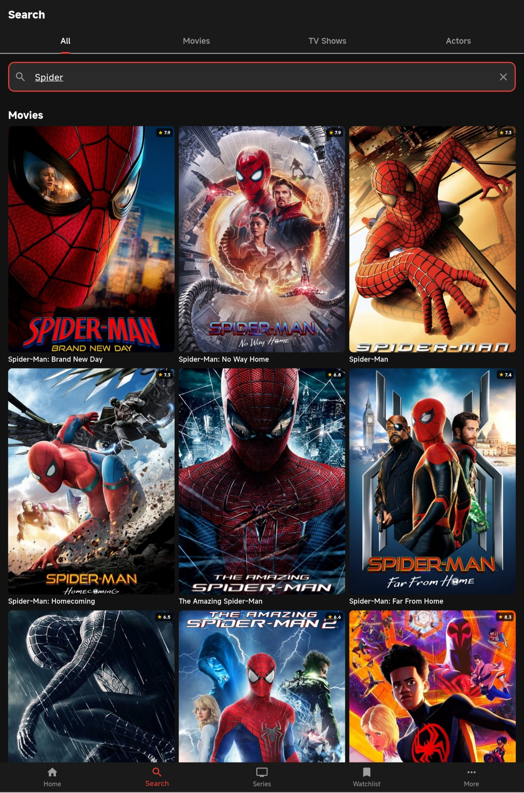
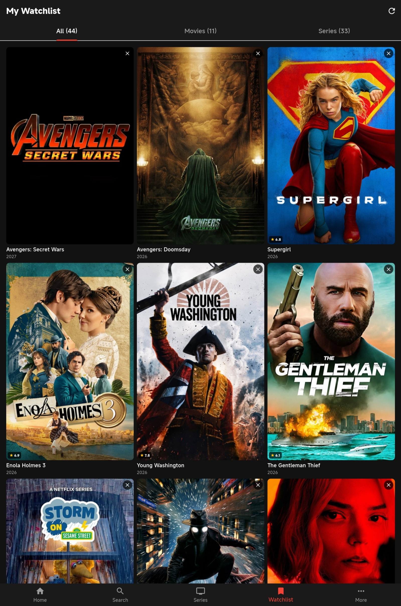
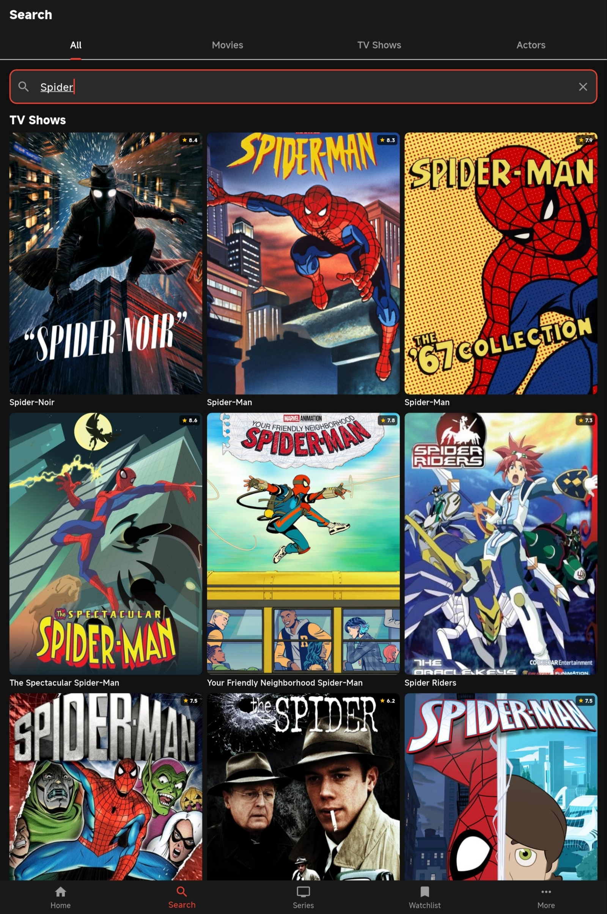
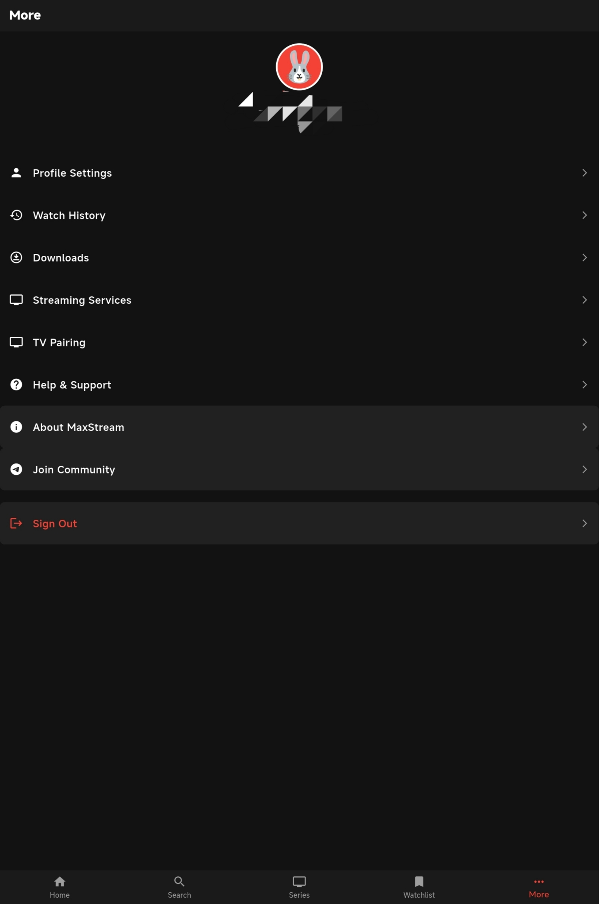

# ذيب ستريم (Theeb Stream)

تطبيق مشاهدة واستكشاف للأفلام والمسلسلات مبني بـ Flutter، مع تطبيق Android TV أصلي بـ Kotlin ودعم مصادر متعددة وتشغيل HLS.

<div align="center">
  
</div>

## Screenshots

<table align="center">
  <tr>
    <td align="center"><br/><sub>Home</sub></td>
    <td align="center"><br/><sub>Search</sub></td>
    <td align="center"><br/><sub>Watchlist</sub></td>
  </tr>
  <tr>
    <td align="center"><br/><sub>Search Results</sub></td>
    <td align="center"><br/><sub>More</sub></td>
  </tr>
</table>

## Features

- **Native Stream Extraction** — Kotlin-powered extraction using OkHttp with DNS-over-HTTPS, parallel server discovery, and HLS validation
- **Multi-Provider Fallback** — 20+ stream sources tried automatically: VidLink, VixSrc, Vidrock, Vidzee, Videasy, PrimeSrc, Frembed, RPM, VidsrcNet, VidsrcRu, VidsrcTo, Moviesapi, 2Embed, Vidflix, VOE, Streamtape, and more
- **Smooth HLS Playback** — Parallel variant validation, ExoPlayer with 30s back buffer, adaptive quality switching
- **Subtitle Support** — Grouped by source server (VidLink, RPM, Vidsrc, HLS), SRT/VTT parsing, inline display
- **Quality Selection** — Manual quality picker with auto-switching support
- **Episode Autoplay** — Auto-advances to next episode with 30s countdown
- **Watch History** — Resume playback from last position, saved every 15 seconds
- **Watchlist** — Save favorite content for later
- **TMDB Integration** — Movie/series metadata, posters, backdrops, episode info
- **TV Mode** — Dedicated Android TV interface with D-pad navigation
- **Auto-Update** — Checks GitHub Releases for new versions, shows changelog, downloads and installs APK
- **Push Notifications** — Content availability alerts via Firebase

## Architecture

### Stream Extraction Pipeline

```
User selects content
    ↓
DirectM3u8Service.fetchMovieStreamUrl() / fetchSeriesStreamUrl()
    ↓
NativeStreamExtractor.resolveStream()  [Platform Channel]
    ↓
StreamExtractor.resolveStream()  [Kotlin, OkHttp]
    ↓
┌─────────────────────────────────────────┐
│  Server Providers (parallel discovery)  │
│  StaticTmdbProvider, VidrockProvider,   │
│  VidzeeProvider, PrimeSrcProvider,      │
│  FrembedProvider                        │
└─────────────────────────────────────────┘
    ↓  (20+ servers per movie)
┌─────────────────────────────────────────┐
│  Host Extractors (per-URL matching)     │
│  VidLink (WebView), RPM (AES-CBC),     │
│  VixSrc (signed URLs), VidsrcNet       │
│  (10 decryption algos), Vidrock,       │
│  Vidzee (AES-GCM), VOE, GenericMedia   │
└─────────────────────────────────────────┘
    ↓
Parallel HLS Validation (coroutineScope + async)
    ↓
video_player + Chewie (ExoPlayer on Android)
    ↓
Video plays with subtitles, quality switching, episode autoplay
```

### How Stream Extraction Works

1. **Server Discovery** — Multiple `ServerProvider`s run in parallel, each generating server URLs from TMDB IDs
2. **Extractor Dispatch** — Each server URL is matched to a `HostExtractor` by domain
3. **Stream Resolution** — Extractors resolve embed pages, decrypt payloads, follow redirects
4. **Redirect Chaining** — Up to 5 redirect hops with cycle detection
5. **HLS Validation** — Master playlist parsed, variants validated in parallel, subtitles extracted
6. **Playback** — URL handed to ExoPlayer with headers, back buffer configured

### Key Extractors

| Extractor | Technique |
|-----------|-----------|
| **VidLink** | WebView JS injection intercepts `/api/b/` fetch responses |
| **RPM** | AES-CBC decryption of hex payload, 5 route candidates (HLS, TikTok, Cloudflare) |
| **VixSrc** | Signed URL construction with token expiry, 410 retry |
| **VidsrcNet** | 3-level iframe chain, 10 per-ID decryption algorithms (XOR, Base64, ROT13) |
| **Vidrock** | AES-encrypted TMDB ID, tries all servers from API response |
| **Vidzee** | AES-GCM master key from remote API, AES-CBC link decryption |
| **VidsrcRu** | WebView network interception of `/file2/*.m3u8` URLs |
| **VidsrcTo** | RC4 decryption with GitHub-hosted keys, multi-source fallback |
| **Frembed** | API-based server list with HTTP redirect resolution |
| **GenericMedia** | Catch-all regex scan for `.m3u8`/`.mp4` URLs in page HTML |

## Tech Stack

- **Framework**: Flutter 3.8.0+ (Dart)
- **Native**: Kotlin (Android) — stream extraction, HLS validation
- **Video**: video_player + Chewie (ExoPlayer on Android)
- **HTTP**: OkHttp with DNS-over-HTTPS (Google DNS)
- **Database**: Firebase Firestore + SQLite (local)
- **API**: TMDB API (movie/series metadata)
- **State**: Provider
- **UI**: Material Design, Glassmorphism, Shimmer, Lottie

## Project Structure

```
lib/
├── main.dart / main_phone.dart     # App entry points
├── screens/                         # UI screens
│   ├── m3u8_video_player_screen.dart  # Main video player with subtitles, quality, autoplay
│   ├── maxstream_main_screen.dart     # Bottom nav (Home, Search, Series, Watchlist, More)
│   ├── maxstream_home_screen.dart     # Home with hero banners, sliders
│   ├── maxstream_search_screen.dart   # Search with All/Movies/TV/Actors tabs
│   ├── maxstream_details_screen.dart  # Movie/series detail pages
│   ├── maxstream_series_list_screen.dart
│   ├── maxstream_watchlist_screen.dart
│   └── streaming_provider_settings_screen.dart
├── services/
│   ├── native_stream_extractor.dart   # Platform channel bridge to Kotlin
│   ├── direct_m3u8_service.dart       # Stream URL resolution service
│   ├── tmdb_api_service.dart          # TMDB API client
│   ├── profile_service.dart           # Local-only profile customization
│   ├── watch_history_service.dart     # SQLite watch history
│   ├── update_service.dart            # GitHub Releases auto-updater
│   ├── notification_service.dart      # Local notifications
│   └── user_service.dart              # User profile management
├── tv/                               # Android TV interface
│   ├── screens/                       # TV-optimized screens
│   ├── widgets/                       # TV focus, navigation, keyboard
│   ├── services/                      # TV scraper service
│   └── providers/                     # TV state management
├── widgets/                          # Reusable UI components
├── models/                           # Data models (Movie, Series)
├── database/                         # SQLite helpers
├── config/                           # API configuration
└── utils/                            # Utilities, responsive helpers

android/app/src/main/kotlin/com/maxstream/app/
├── MainActivity.kt                   # Platform channel handler
└── StreamExtractor.kt                # Stream extraction + HLS validation

> ملاحظة: مسار Kotlin/namespace التاريخي بقي كما هو لتجنب كسر المعرفات الداخلية بلا داعٍ، بينما applicationId النهائي لأندرويد هو `com.theebstream.app`.
```

## Getting Started

### Prerequisites

- Flutter SDK >=3.8.0
- Firebase project only if optional notification/Crashlytics services are enabled
- TMDB API key

### Installation

```bash
git clone https://github.com/theeb1230-dot/theeb_stream.git
cd theeb_stream
flutter pub get
flutter run
```

### Configuration

1. **Firebase** — اختياري فقط للخدمات غير المرتبطة بتسجيل الدخول مثل الإشعارات وCrashlytics عند تفعيلها؛ تشغيل التطبيق الأساسي لا يتطلب Firebase Auth.
2. **TMDB** — Get API key from [themoviedb.org](https://www.themoviedb.org/settings/api), add to `lib/config/api_config.dart`

## Auto-Update System

The app checks GitHub Releases on startup for newer versions:

1. Hits `https://api.github.com/repos/theeb1230-dot/theeb_stream/releases/latest`
2. Compares release tag (e.g. `v1.0.1`) with installed version
3. Shows local notification + in-app dialog with changelog from release body
4. Downloads `Theeb-Stream-Android-Mobile-arm64-v8a.apk` from the release assets
5. Prompts Android package installer

To release an update:
1. استخدم نفس commit/tag لبناء Android Mobile وAndroid TV وiOS.
2. يجب أن يطابق tag نسخة `pubspec.yaml` الحالية، مثل `v1.6.0`.
3. ارفع الأصول النهائية إلى قسم GitHub Releases في هذا المستودع:
   - `Theeb-Stream-Android-Mobile-arm64-v8a.apk`
   - `Theeb-Stream-Android-TV.apk`
   - `Theeb-Stream-iOS-UNSIGNED-no-codesign.ipa`
4. أرفق SHA-256 ونتائج analyze/tests/build في release notes.
5. ملف iOS الموصوف بأنه UNSIGNED/no-codesign غير قابل للتثبيت مباشرة ويحتاج توقيع Apple وprovisioning صالحين خارجيًا.

## Build

```bash
# Android Mobile APKs
flutter build apk --release --split-per-abi

# Android TV
cd android
./gradlew assembleFossUniversalRelease

# iOS unsigned / no-codesign
cd ..
flutter build ios --release --no-codesign
```

GitHub Actions يبني المسارات الثلاثة بصورة مستقلة. نجاح build وحده لا يعني أن iOS IPA قابلة للتثبيت؛ ملف iOS غير الموقع يحتاج توقيعًا وprovisioning خارجيين صالحين.

## Version

- **Current**: 1.6.0+8
- **Min SDK**: 3.8.0

## Contributing

Pull requests welcome. For major changes, open an issue first.

## License

MIT License — see [LICENSE](LICENSE) for details.

## Author

**Theeb Stream** — [theeb1230-dot/theeb_stream](https://github.com/theeb1230-dot/theeb_stream)
